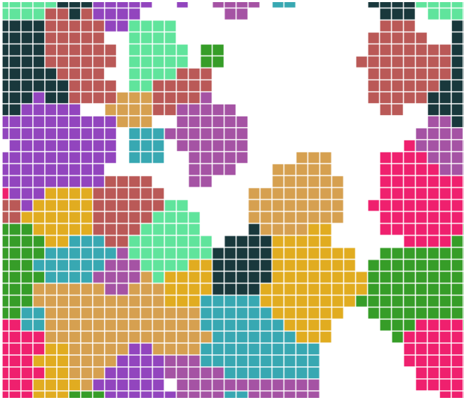
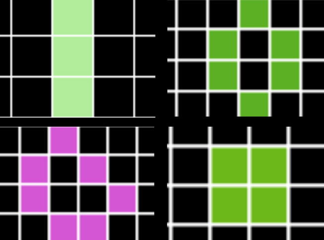

# Simulation-of-Multiagent-Systems-OOP

By defining an agent as an autonomous entity that acts in a defined environment, a multi-agent system will be a system composed of a set of active agents, interacting with their environment according to certain rules.
This principle thus offers several interesting possibilities for modeling large groups of autonomous entities,  such as human and animal societies... 
Thus, it finds applications in several domains such as human sciences, television, video games...
We are therefore **interested** in the simulation of these multi-agent systems.

## 1/ Cellular Automaton :

#### 1 - Simulation of Conway's Game of Life :

#### 2 - Simulation of  Schelling's Game :

## 2/ Boids :

- **<u>TestBirdsSimulator</u>** which implements groups of different swarms, of different colors and speeds, which move in the same environment independently of each other.
- **<u>TestHungryBoids</u>** which represents several groups of swarms, each with its own food
which it targets.
- **<u>TestFollowersSimulator</u>** which represents several groups of swarms forced to stay close to a path, and which therefore going back and forth horizontally on this Path
- **<u>TestPreyspredators</u>** which represents a group of preys and another of predators .

